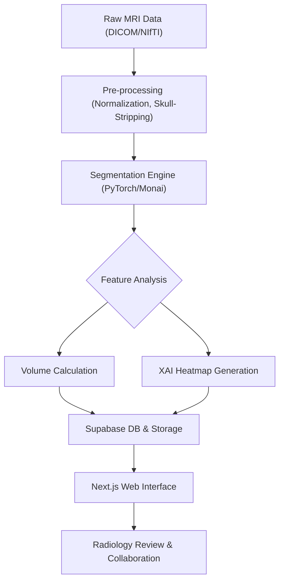

# [Research Report] Brain MRI Assist: Deep Learning-Based Automated Neuroimaging Segmentation and Diagnostic Support System

  
   
  <em>U-Net 기반의 실시간 뇌 MRI 병변 세그멘테이션 시연입니다. 슬라이스 이동에 따른 적응형 마스킹 및 환부 부피 분석 워크플로우를 시각화합니다.</em>

## 1. Clinical Background & Research Objective

뇌 자기공명영상(Magnetic Resonance Imaging, MRI)은 중추신경계(Central Nervous System) 질환의 진단과 치료 계획 수립에 있어 중추적인 역할을 수행하는 비침습적 진단 도구이다. 그러나 뇌 MRI 판독 과정은 고도의 전문성을 요하며, 특히 종양(Tumor), 뇌졸중(Stroke) 병변 및 해부학적 구조물(Ventricle, Gray/White Matter)의 정밀한 분할(Segmentation)은 다음과 같은 한계점을 수반한다:

*   **판독자 간 편차(Inter-observer Variability):** 판독의 숙련도와 주관적 해석에 따라 병변 경계 설정의 일관성이 결여될 우려가 존재한다.
*   **분석 시간의 비효율성:** 수백 장의 슬라이드를 수동으로 분석하는 과정은 막대한 시간적 자원을 요구하며, 이는 응급 상황에서의 진단 지연을 초래한다.

본 연구는 딥러닝(Deep Learning) 기반 알고리즘을 활용하여 뇌 MRI 영상 내 주요 병적 구조물 및 해부학적 영역을 픽셀(Pixel) 단위로 정교하게 분할하는 자동화 파이프라인(Automated Pipeline)을 구축한다. 이러한 정밀 분할 기술을 통해 신경외과적 수술 시 절제 범위(Resection Margin) 설정 및 방사선 치료 계획 수립을 위한 정량적 지표를 도출하며, 시간에 따른 체적 변화(Volume tracking)를 모니터링함으로써 예후 분석의 객관성을 규명한다.

---

## 2. Deep Learning Methodology

### 2.1 Model Architecture
의료 영상의 공간적 특징(Spatial Context)을 보존하기 위해, 본 시스템은 **3D Attention U-Net** 아키텍처를 기반으로 설계되었다. 대칭적인 인코더-디코더(Encoder-Decoder) 구조를 통해 고차원 특징(Feature)을 추출하며, 스킵 연결(Skip Connection) 구간에 통합된 **Additive Attention Gate**를 통해 불필요한 노이즈를 억제하고 병변 영역에 대한 가중치를 최적화한다.

### 2.2 Combined Loss Function
의료 영상 데이터셋 특유의 배경(Background)과 병변(Lesion) 사이의 클래스 불균형(Class Imbalance) 문제를 해결하기 위해, 본 시스템은 **Dice Loss**와 **Binary Cross Entropy (BCE) Loss**를 결합한 하이브리드 손실 함수를 적용한다:

$$Dice = \frac{2 |X \cap Y|}{|X| + |Y|}$$

여기서 $X$는 모델의 예측 영역, $Y$는 정답(Ground Truth) 레이블을 의미한다. Dice Loss를 통해 겹침 영역(Intersection)을 최대화하며, BCE Loss를 병행하여 픽셀 단위의 확률 분포를 정밀하게 조정함으로써 모델의 수렴 안정성을 도출한다.

### 2.3 Data Augmentation
데이터 희소성 문제를 극복하고 모델의 일반화 성능(Generalization)을 확보하기 위해 Elastic Transformation, Random Rotation, Intensity Shift 등 의료 영상에 특화된 데이터 증강(Data Augmentation) 전략을 수립하여 최적의 학습 환경을 구축한다.

---

## 3. System Architecture & Medical Workflow

본 시스템은 의료 영상 표준 형식(DICOM, NIfTI)을 처리하는 백엔드(Back-end)와 이를 웹 기반으로 시각화하는 인터페이스(Interface)의 통합 구조를 갖는다. 전반적인 연구 워크플로우를 다음과 같이 정의한다:

1.  **Backend Data Pipeline:** Python 환경의 전처리 모델은 `Nibabel` 및 `Pycom` 라이브러리를 통해 원천 데이터를 파싱(Parsing)하고, 강도 정규화(Intensity Normalization) 및 두개골 제거(Skull-stripping)를 수행한다.
2.  **Web Interface & Collaboration:** 사용자는 **Next.js 14** 기반 인터페이스를 통해 분할된 영상을 슬라이스별로 분석하며, **Supabase** 연동을 통해 데이터의 무결성을 유지하고 연구원 간 실시간 협업 환경을 최적화한다.

---

## 4. Explainable AI (XAI) & Diagnostic Insights

인공지능 진단 보조 시스템의 신뢰성을 담보하기 위해 설명 가능한 인공지능(XAI) 기술을 도입하여 판단 근거를 규명한다.

*   **Grad-CAM Heatmaps:** 모델의 추론 과정에서 중요도가 높은 영역을 히트맵(Heatmap) 형태로 가시화한다. 이를 통해 연구진은 AI의 분할 근거를 시각적으로 검증하며 진단의 투명성을 확보한다.
*   **Quantitative Volumetric Analysis:** 분할된 병변의 체적을 mm³ 단위로 자동 계산하여 도출한다. 다중 시점 데이터 분석 시, 종양의 크기 변화 추이를 정량적으로 추적하여 치료 반응성(Treatment Response)을 정밀하게 분석한다.

---

## 5. Implementation & Technical Specs

### 5.1 Technical Environment
*   **Algorithm Framework:** Python 3.10+ (PyTorch 2.0, Monai, Scikit-image)
*   **Application Stack:** Node.js 18+ (Next.js 14 App Router)
*   **Infrastructure:** Supabase (Database, Object Storage)

### 5.2 Computing Optimization
대용량 3D MRI 텐서(Tensor) 연산 및 추론의 효율성을 극대화하기 위해 맥북 프로 환경에서 **MPS (Metal Performance Shaders)** 하드웨어 가속을 활용한다. 이를 통해 로컬 환경 내에서도 고속 병렬 연산을 수행하며 모델의 실시간 추론 성능을 최적화한다.

---

[Footer]
- **Author:** 권해성 (Hanyang University, Computer Science)
- **Research Interest:** Medical Imaging AI, Neural Radiometry, Computer-Aided Diagnosis (CAD)
